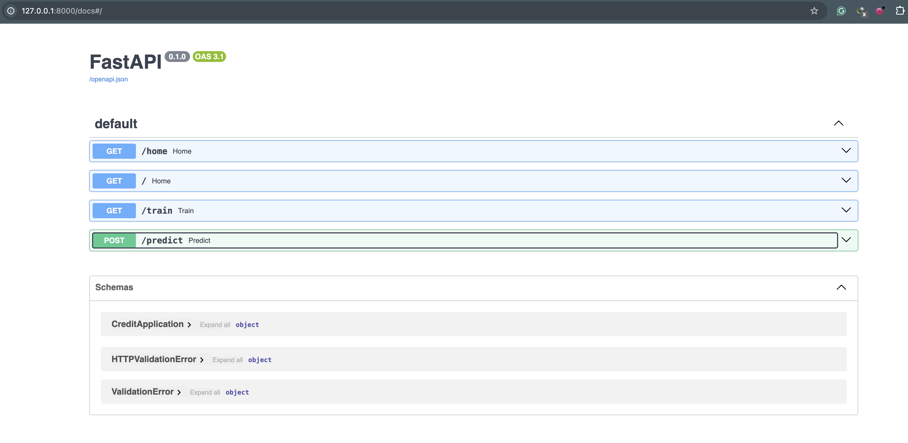

# The Case Study: Classification

With the `classification_data`, build an algorithm to predict the binary label. Build a pipeline going from exploratory analysis to model performance evaluation adding comments to each stage.

## Dictionary

Find below a dictionary of the `classification_data`:

---------------------

| Item | Description|
|-------|--------------|
| User_ID | ID of the customer (unique per customer)|
|Label | Binary classification of  performance; 1 for bad, 0 for good|
|Account Type | Type of customer’ account.|
|Duration of Credit (month) |Tenor of loan in months
| Payment Status of Previous Credit | Status of the customer’s last loan; paid, active, overdue or defaulted.|
| Purpose | Purpose of loan |
| Credit Amount | Loan Amount |
| Savings Type | Type of Savings |
| Length of current employment | Number of years the customer has spent  with the current employer |
| Installment per cent | |
| Marital Status | Marital status of the customer |
| Guarantor | Number of guarantors on loan |
| Duration in Current address | Length of the customer’s stay at current home address (in years) |
| Most valuable available asset | |
| Age | Age of user (in years) |
| Concurrent Credits | |
| Type of Apartment | Type of apartment user resides in; rented, family owned etc. |
| No of Credits at this Bank | Number of previous loans taken by the customer |
| Occupation | Occupation of the customer |
| Telephone | Phone number of the customer. |
| Foreign Worker | Is the customer a foreigner working in the country? |

## Project Directory Structure

### CLASSIFICATION_DATA/

This is the root directory containing all files and subfolders related to the classification project.

---------------------

### ├── assets/

Stores assets used throughout the project.

- **imgs/**: Holds the images for use in README.
  - **swagger_ui.png**: Screenshot of swagger_ui landing page.

---------------------

### ├── config/

Stores configuration and metadata files that are used throughout the project.

- **best_params.json**: Contains the optimal hyperparameters for model training.
- **cat_cols.json**: Lists the categorical columns in the dataset.
- **columns.json**: Metadata about all dataset columns.
- **scaled_cols.json**: Keeps track of columns that have been scaled.

---------------------

### ├── data/

Contains the project datasets, separated into raw and processed formats.

- **processed/**: Holds the cleaned datasets for use in modeling.
  - **classification_data_clean.csv**: Cleaned and preprocessed version of the dataset.
- **raw/**: Contains the original, unprocessed dataset.
  - **classification_data.csv**: The raw dataset before any cleaning or transformations.

---------------------

### ├── model_checkpoints/

This directory stores trained models and any saved checkpoints.

- **model_v1.pkl**: Pickle file containing the trained model (version 1).

---------------------

### ├── modelling/

This folder is for scripts or utilities related to model creation or enhancements.

- **preprocess**: Contains scripts responsible for preprocessing and cleaning the dataset.

  - ****init**.py**: Marks this directory as a Python package.
  - **data_preprocessor.py**: Script that handles data cleaning and preprocessing operations.

- **train/**: Contains the scripts needed to train the machine learning model.

  - ****init**.py**: Marks this directory as a Python package.
  - **model_trainer.py**: Script responsible for training the model using the preprocessed data.

---------------------

### ├── notebook/

Holds Jupyter notebooks used for interactive experimentation and data exploration.

- **notebook.ipynb**: Notebook containing exploratory data analysis, model training, or other tasks.

---------------------

### ├── .env

Environment file that stores sensitive information like API keys or environment variables.

---------------------

### ├── app_schema.py

Defines the schema for inputs related to the API for serving the model.

---------------------

### ├── app.py

Main application script that possibly serves the trained model via an API.

---------------------

### ├── README.md

Documentation file providing an overview of the project, setup instructions, and usage details.

---------------------

### ├── requirements.txt

Lists all Python dependencies and packages required to run the project.

## Running The Application

Here is a step-by-step guide to running the project:

---------------------

### Step-by-Step Guide to Running the Classification Project

### Prerequisites

Before you begin, ensure you have the following installed:

- **Python 3.10+**

- **pip** (Python package manager)

- **virtualenv** (optional but recommended)

---------------------

### 1. **Clone the Project Repository**

Download the application to your environment and change your present working directory (`pwd`) to the root of the application

```bash
cd classification_data
```

---------------------

### 2. **Set Up a Virtual Environment (Optional but Recommended)**

It’s good practice to use a virtual environment to isolate your application’s dependencies.

#### On MacOS/Linux

```bash
python3 -m venv venv
source venv/bin/activate
```

#### On Windows

```bash
python -m venv venv
venv\Scripts\activate
```

---------------------

### 3. **Install Dependencies**

Use `pip` to install the required Python packages listed in `requirements.txt`.

```bash
pip install -r requirements.txt
```

This will install packages such as:

- Pandas
- Scikit-learn
- FastAPI (for running the API)
- Many other dependencies required for model training, data preprocessing, or deployment.

---------------------

### 4. **Run the Application**

The project contains a FastAPI app for serving the trained model (via `app.py`), follow these steps to run it:

1. **Start the Application**:
   You can run the API by executing:

   ```bash
   uuvicorn app:app
   ```

Or simply use Python

   ```bash
   python app.py
   ```

   This will start the Flask/FastAPI app, which can be accessed at [`http://localhost:8000`](http://localhost:8000).

This application has 4-routes:

- GET [`/`](http://localhost:8000/): no params
- GET [`/home`](http://localhost:8000/home): no params
- GET [`/train`](http://localhost:8000/train): no params
- POST `/predict`, expecting a `json` type request body like:

```json
{
  "Account_type": 1,
  "Duration_of_Credit_month": 18,
  "Payment_Status_of_Previous_Credit": 4,
  "Purpose": 2,
  "Credit_Amount": 1049,
  "Savings_type": 1,
  "Length_of_current_employment": 2,
  "Instalment_per_cent": 4,
  "Marital_Status": 2,
  "Guarantors": 1,
  "Duration_in_Current_address": 4,
  "Most_valuable_available_asset": 2,
  "Age": 21,
  "Concurrent_Credits": 3,
  "Type_of_apartment": 1,
  "No_of_Credits_at_this_Bank": 1,
  "Occupation": 3,
  "No_of_dependents": 1,
  "Telephone": 1,
  "Foreign_Worker": 1
}
```

2. **Test the API**:

You can use any of the following you are most comfortable with to test the APIs

- (Most Preferable) Access the Swagger docs via [`http://localhost:8000/docs`](http://localhost:8000/docs)


- (Preferable) Use a tool like **Postman** to send requests to the API.
- (Least Preferable) Use `curl` to send request to get predictions:

     ```bash
     curl -X 'POST' \
  'http://127.0.0.1:8000/predict' \
  -H 'accept: application/json' \
  -H 'Content-Type: application/json' \
  -d '{
    "Account_type": 1,
    "Duration_of_Credit_month": 18,
    "Payment_Status_of_Previous_Credit": 4,
    "Purpose": 2,
    "Credit_Amount": 1049,
    "Savings_type": 1,
    "Length_of_current_employment": 2,
    "Instalment_per_cent": 4,
    "Marital_Status": 2,
    "Guarantors": 1,
    "Duration_in_Current_address": 4,
    "Most_valuable_available_asset": 2,
    "Age": 21,
    "Concurrent_Credits": 3,
    "Type_of_apartment": 1,
    "No_of_Credits_at_this_Bank": 1,
    "Occupation": 3,
    "No_of_dependents": 1,
    "Telephone": 1,
    "Foreign_Worker": 1
    }'
     ```

---------------------

### 5. **Run Jupyter Notebook (Optional)**

The project includes a Jupyter notebook (`notebook/notebook.ipynb`) which might contain exploratory data analysis (EDA), model experimentation, or other interactive tasks.

To run the notebook:

1. Launch Jupyter:

   ```bash
   jupyter notebook
   ```

2. Open `notebook.ipynb` in the Jupyter interface.

---------------------

### 6. **Cleanup and Deactivate the Virtual Environment (Optional)**

After you are done, you can deactivate the virtual environment:

```bash
deactivate
```

---------------------

### Troubleshooting

- **Dependency Issues**: If any dependencies fail to install, ensure you are using the correct Python version and try upgrading `pip`.
- **Dataset Not Found**: Ensure that the raw dataset is in the correct path (`data/raw/classification_data.csv`). You may need to download it again if missing.
- **Model Not Found**: If the trained model is not found, ensure that the training script has successfully completed, and the model is saved under `model_checkpoints/model_v1.pkl`.

---------------------

This should be a comprehensive guide to get the application up and running! If you encounter any specific issues, check the README file or refer to the error messages for further troubleshooting.
